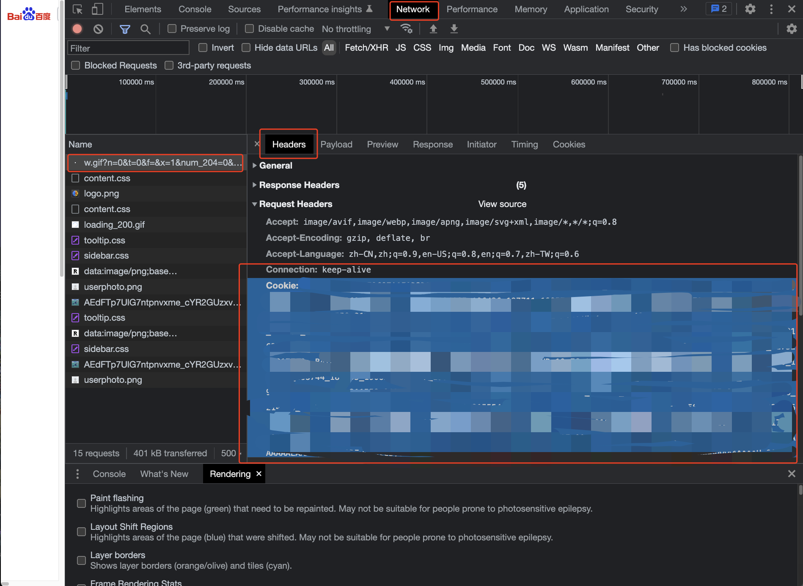

# DB-GPT 百度搜索插件(从AUTO-GPT插件继承修改而来)

语言: [English](https://github.com/Significant-Gravitas/Auto-GPT-Plugins/tree/master/src/autogpt_plugins/baidu_search/README.md) | [中文](https://github.com/Significant-Gravitas/Auto-GPT-Plugins/tree/master/src/autogpt_plugins/baidu_search/README.zh.md)

此搜索插件将百度搜索引擎集成到 DB-GPT中，作为数据搜索引擎。

## 主要功能：
- 百度搜索：使用百度搜索引擎进行搜索查询。

## 工作原理：
如果设置了搜索引擎（`SEARCH_ENGINE`）和Baidu Cookie(`BAIDU_COOKIE`)的环境变量，搜索引擎将设置为百度。

### 获取百度 Cookie:
1. 打开 Chrome 浏览器并在百度上搜索随便某个内容。
2. 打开开发者工具（按 F12 或右键单击并选择 "审查元素"）。
3. 转到 "网络" 标签。
4. 在网络请求列表中找到第一个名称文件。
5. 在右侧找到 "Cookie" 并复制所有内容（很长，需要全部复制）。



`.env` 文件示例：

```
SEARCH_ENGINE=baidu
BAIDU_COOKIE=your-baidu-cookie
```

请将 `your-baidu-cookie` 替换为从 Chrome 开发者工具获取的实际 Cookie 内容。

