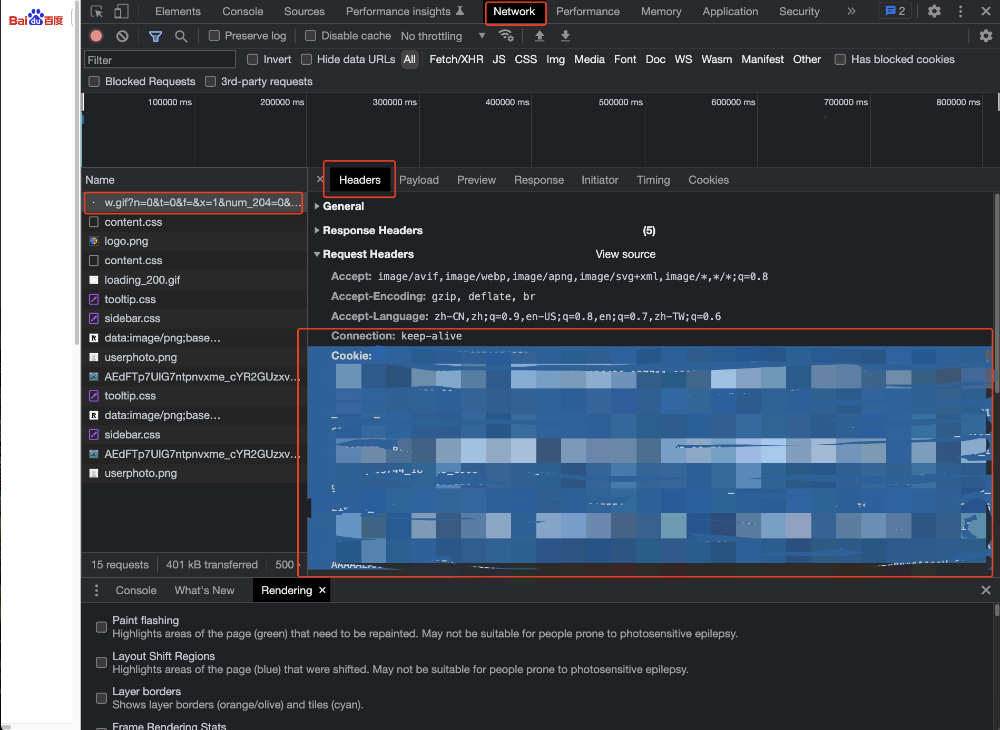
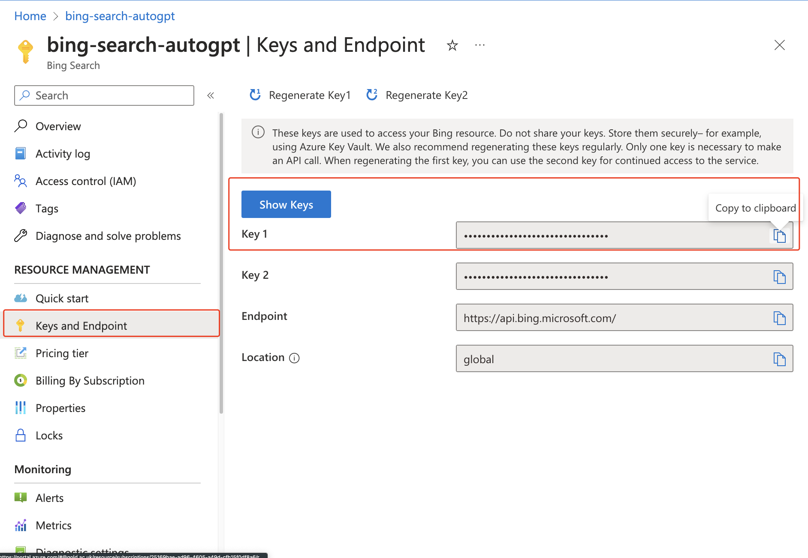
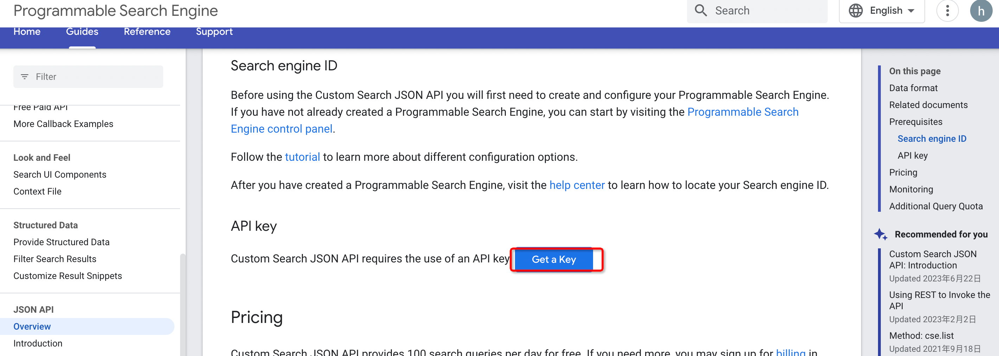
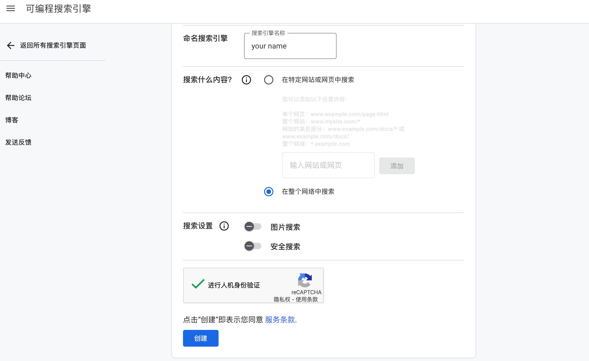

# DB-GPT Search Engine Plugin (Inherit modifications from AutoGPT plugin)

This search engine plug-in supports information acquisition through Baidu, Google, and Bing search engines.

## Key Features:
- Baidu Search: Perform search queries using the Baidu search engine.
- Google Search: Perform search queries using the Google search engine.
- Bing Search: Perform search queries using the Bing search engine.

## How it works
If the environment variables for the search engine (`SEARCH_ENGINE`) are not configured,  baidu or google will be automatically selected based on the language attribute, or you can set which one to use by default, with a configurable range (baidu, google, bing).

## Obtaining Baidu Cookie:
1. Open the Chrome browser and search for something on Baidu.
2. Open Developer Tools (press F12 or right-click and select "Inspect").
3. Go to the "Network" tab.
4. Find the first name file in the list of network requests.
5. On the right side, find the "Cookie" header and copy all of its content(it's very long).



Set the `BAIDU_COOKIE` in the `.env` file:
```
BAIDU_COOKIE=your-baidu-cookie
```

## Obtaining Bing Cookie:
1. Go to the [Bing Web Search API](https://www.microsoft.com/en-us/bing/apis/bing-web-search-api) website.
2. Sign into your Microsoft Azure account or create a new account if you don't have one.
3. After setting up your account, go to the "Keys and Endpoint" section.
4. Copy the key from there and add it to the `.env` file in your project directory.
5. Name the environment variable `BING_API_KEY`.




Set the `BING_API_KEY` in the `.env` file:
```
BING_API_KEY=your_bing_api_key
```

## Obtaining Google Cookie:
1. Go to the [Programmable Search Engine](https://developers.google.com/custom-search/v1/overview#api_key) website.
2. Go to the [Programmable Search Engine](https://programmablesearchengine.google.com/controlpanel/create) website.
3. Get the API key and cx add it to the `.env` file in your project directory
4. You can refer to website https://developers.google.com/custom-search/v1/reference/rest



Set the `GOOGLE_API_KEY` and  `GOOGLE_API_CX` in the `.env` file:
```
GOOGLE_API_KEY=your_google_api_key
GOOGLE_API_CX=your_google_api_cx
```